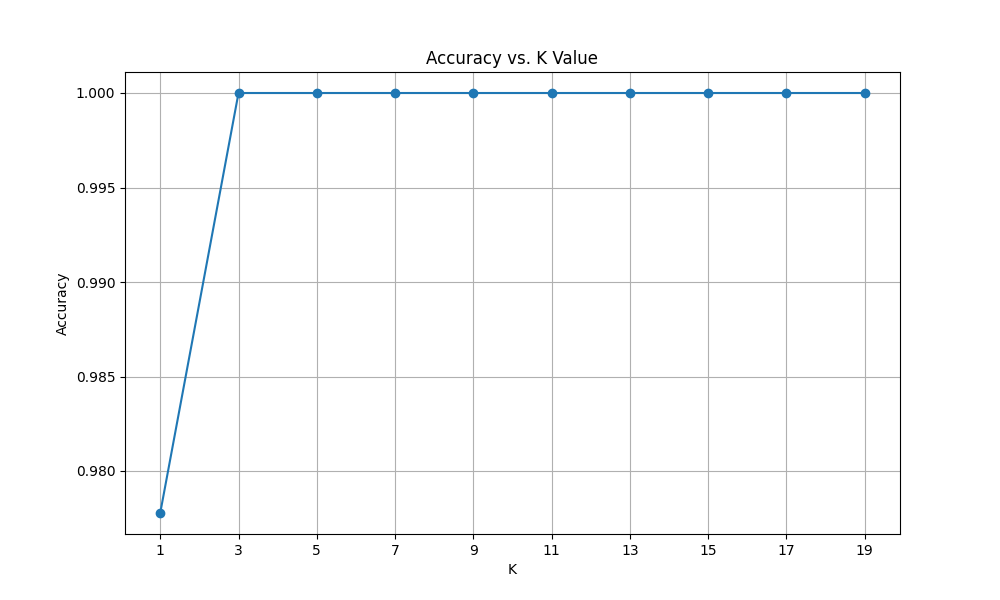

#  K-Nearest Neighbors (KNN) Classification
This python notebook is a demonstration of classification of Species of Iris flowers using K Nearest Neighbors

The source for dataset - [https://www.kaggle.com/datasets/uciml/iris]


## 💻 Installation

Follow these steps to set up the project locally.

### **Clone the repository**
   ```bash
   git clone [https://github.com/your-username/repository-name.git](https://github.com/your-username/repository-name.git)
   ```
   ```bash
    python train.ipynb
```

### Accuracy VS K Nearest valu

